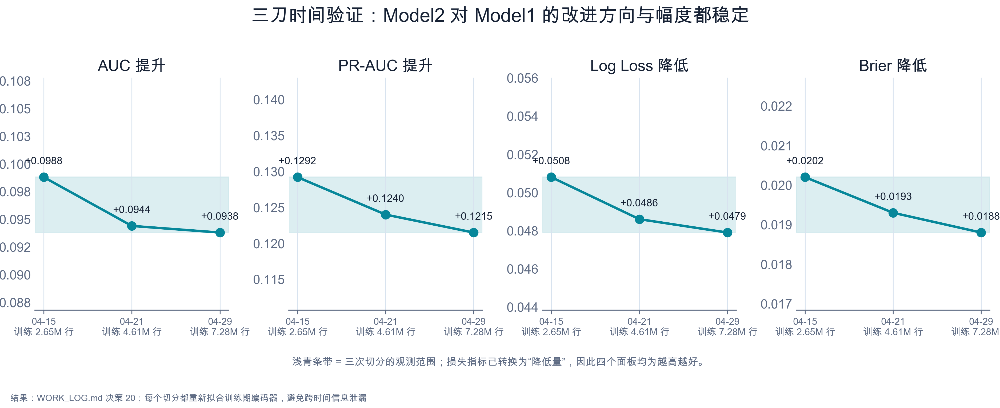
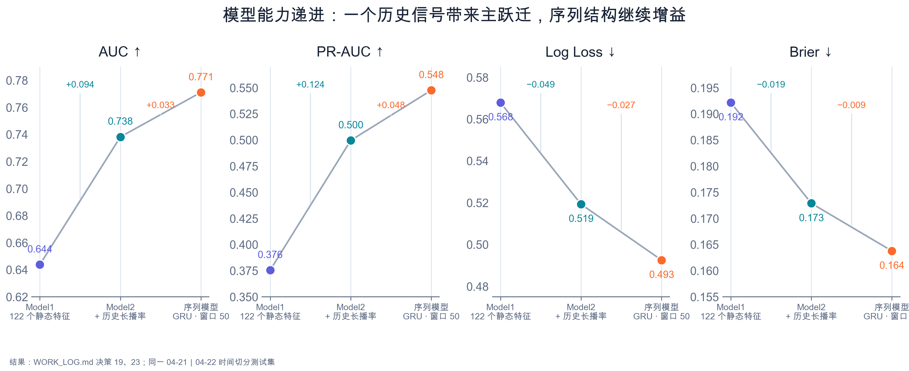
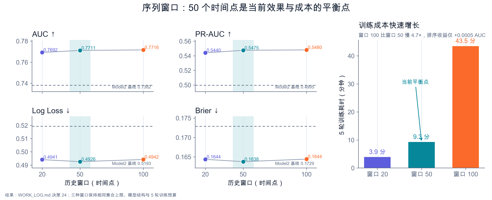
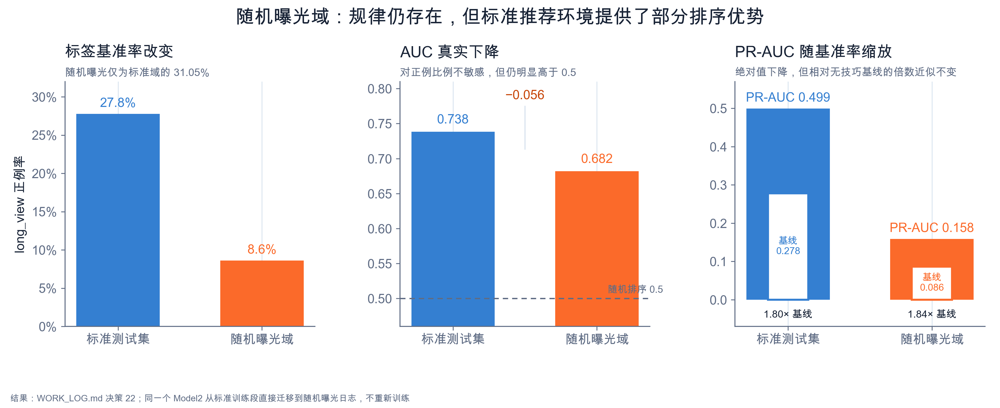
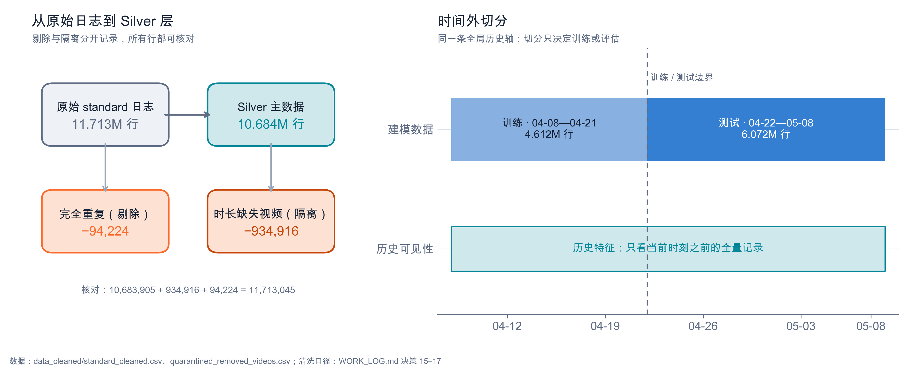
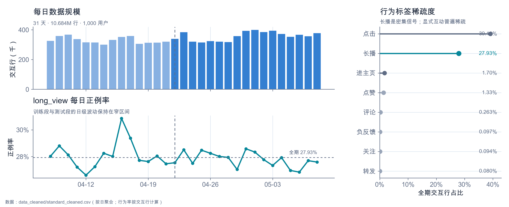
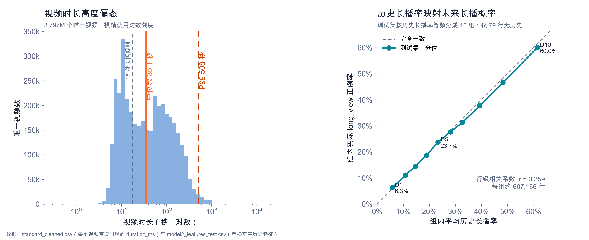

# KuaiRand 历史行为特征研究

用 [KuaiRand-1K](https://github.com/chongminggao/KuaiRand)（快手公开的无偏序列推荐数据集）做的一次探索性分析：用户过去的行为，对预测他接下来会不会长时间观看一个视频，有没有帮助？

从原始日志清洗开始，分阶段验证不同的历史特征，最后搭了一个小规模序列模型做对比。下面只总结目前跑出来的结果，每一步具体怎么做、遇到什么问题、还有哪些没做完，见 [WORK_LOG.md](./WORK_LOG.md)——本文档说"现在是什么样"，WORK_LOG 说"怎么走到这一步、为什么"。

## 结果（按阶段）

下文关注的因变量是"长播"（数据集字段 `long_view`）；四项指标贯穿各阶段对比：AUC、Log Loss、Brier、PR-AUC。

### 阶段一：单一历史信号（历史长播率）

一个简单的聚合特征——该用户过去长播的比例——加入静态特征模型后，测试集上四项指标同方向改善（AUC 提升约 0.09）。在三个不同的时间切分下重复这个对比，方向和幅度基本一致（AUC 提升 0.094~0.099），判断不是某次切分的巧合。


*三个不同时间切分下，提升的方向和幅度都保持稳定*

### 阶段二：加入更多历史比率信号

在阶段一基础上，一次性加入历史点赞率、评论率、转发率、进主页率四个信号。结果四项指标的差值都在 10⁻⁵ 量级，方向也不一致，判定为训练噪音，没有实质提升。查过回归系数确认这是与长播率信息重叠，不是互相抵消。历史点击率因 `is_click` 定义随场景变化、含义不清，尚未纳入评估。

### 短窗口序列模型

用一个只处理最近若干次曝光、结构较轻量的序列模型（GRU）替代"历史长播率"这一单一比率特征，四项指标在测试集上全面超过阶段一的结果；对比窗口长度 20/50/100，50 是本机三档里的折中，不是普遍最优，窗口 100 在同样 5 轮训练下效果反而略有回落，判断是训练不足而非窗口本身更差。


*Model1（静态特征）、Model2（+历史长播率）、序列模型三者的四项指标对比*

**这部分结论目前只基于一次时间切分**，尚未像阶段一那样做多刀时间验证，也未做下面的随机曝光域检验——这两项检验此前只对阶段一的模型做过，序列模型的稳健性还有待确认，不应视为与阶段一同等确定的结论。


*窗口 20/50/100 的效果与训练成本对比*

### 随机曝光域检验

把阶段一训练好的模型直接用于完全随机曝光的数据（不重新训练），AUC 从 0.738 降到 0.682，明显低于标准测试集但仍远好于瞎猜（0.5）。说明模型学到的规律不是纯粹的算法曝光偏差假象，但确实有一部分依赖标准推荐算法制造的曝光模式，脱离这个模式后排序能力打了折扣。


*迁移到完全随机曝光的数据上重新评估，效果打折但仍远好于瞎猜*

### 尚未测试 / 主动搁置的部分

以下不是遗漏，是明确记在 WORK_LOG 里、留待以后再看的事项：

- 序列模型（窗口 50）尚未做多刀时间验证和随机曝光域检验
- 数值平均类（历史平均观看时长、播放进度、停留时长）、总量计数类、新近度类（距上次互动间隔）等候选特征均未测试
- 历史点击率因场景定义不清，未纳入
- `user_active_degree` 字段中 4 个未文档化的取值如何处理，尚未决定
- 更大规模的长序列建模（几千到十几万条完整历史）需要 CUDA GPU，当前硬件（Mac）不支持

详细的实验设计、每一步踩过的坑，都在 [WORK_LOG.md](./WORK_LOG.md) 里。

## 环境准备

1. Python 3.12+，建议用独立虚拟环境：

   ```bash
   python3 -m venv .venv
   source .venv/bin/activate
   pip install -r requirements.txt
   ```

2. 自行获取 KuaiRand-1K 数据集（公开数据集，需单独下载，本仓库不包含数据），设置环境变量指向其中的 `data/` 目录：

   ```bash
   export KUAIRAND_DATA_DIR="/path/to/KuaiRand-1K/data"
   ```

## 目录结构

- `scripts/` —— 全部分析脚本，按下面的顺序运行
- `WORK_LOG.md` —— 决策日志，记录每一步选了什么、为什么、结果如何
- `figures/` —— 结果图表（分布在"运行顺序"和"结果"两节里）
- `data_cleaned/`（不进 git）—— 脚本运行后生成的中间数据，可随时重新生成

## 运行顺序

分四个阶段跑，后面的脚本依赖前面脚本生成的中间文件：

### 一、清洗与校验

- `explore_scale.py` —— 摸底：数据规模、每用户历史长度分布
- `clean_data.py` —— 清洗：去重、隔离时长异常的记录（不删除，单独存档）
- `diagnose_rule3.py` / `diagnose_duration.py` —— 诊断清洗规则的具体命中情况
- `verify_time_ms.py` / `verify_history_independent.py` —— 校验时间戳可靠性、历史特征计算是否正确

### 二、切分、历史特征与基线对比

- `split_train_test.py` —— 按时间切分训练/测试集
- `build_history_feature.py` / `add_more_history_features.py` —— 计算历史聚合特征（时间点安全，不泄漏未来信息）
- `build_gold_model1.py` / `build_gold_model2.py` / `align_model1.py` —— 拼接静态特征，产出可训练的数据表
- `train_compare.py` / `compare_all_history.py` / `inspect_coefficients.py` —— 基线模型对比与系数分析
- `multi_split_validation.py` —— 多次时间切分的稳健性检验

### 三、短窗口序列模型

- `build_nested_sequence.py` / `build_row_to_seq_mapping.py` / `sequence_model.py` / `train_sequence_model_full.py` —— 小规模序列模型
- `build_sequence_multi_window.py` / `train_multi_window.py` —— 序列窗口长度对比

### 四、随机曝光域检验

- `random_exposure_check.py` —— 把训练好的模型用于完全随机曝光的数据做泛化检验

跑完以上步骤后，`generate_visualizations.py` 根据产出的数据和 WORK_LOG 里的结果，生成本文档中的图表。

清洗、切分这几步产出的数据长这样：


*原始日志到清洗后的中间表的行核对，以及训练/测试的时间外切分方式*


*每日数据规模、long_view 每日正例率、各反馈信号的稀疏程度*


*视频时长的高度偏态分布，以及历史长播率与未来长播概率的关系*

## License

本仓库的代码采用 MIT 许可，见 [LICENSE](./LICENSE)。

**该许可仅覆盖本仓库中的代码，不覆盖 KuaiRand-1K 数据集本身。** 数据集由原作者另行发布和许可，本仓库不包含、不分发数据，使用前请自行从 [KuaiRand 官方仓库](https://github.com/chongminggao/KuaiRand) 获取数据并遵守其自己的许可条款。
